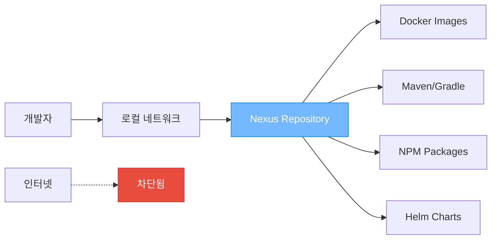

### 독립망(Air-gapped) 환경이란?

- **정의**: 인터넷이 완전히 차단된 네트워크 환경
- **목적**: 보안성 극대화, 외부 침입 원천 차단
- **특징**: 내부 네트워크는 유지, 외부 인터넷만 차단

### Nexus Repository의 역할



> [!important] 핵심 아이디어 Nexus = 독립망 환경의 "종합 패키지 창고" 개발에 필요한 모든 것을 미리 저장해두어 인터넷 없이도 완전한 개발 환경 구축 가능

## 🐳 독립망에서 이미지 Pull 설정

### 서비스 포트 확인

```bash
kubectl get svc -n cicd nexus-nexus-repository-manager
# 결과: 
# 8081:30081/TCP  <- Nexus UI
# 9900:32415/TCP  <- Docker Registry
```

### Docker 설정 (모든 노드)

```bash
# /etc/docker/daemon.json
{
  "insecure-registries": ["<node-ip>:32415", "localhost:32415"]
}

sudo systemctl restart docker
```

### 이미지 사용

```bash
# Docker 로그인
docker login <node-ip>:32415
Username: admin
Password: <admin-password>

# 이미지 Pull (구조: <registry>/<path>:<tag>)
docker pull <node-ip>:32415/my-docker-image/jaeger-agent:1.62.0

# Kubernetes에서 사용
apiVersion: apps/v1
kind: Deployment
spec:
  template:
    spec:
      containers:
      - name: jaeger-agent
        image: <node-ip>:32415/my-docker-image/jaeger-agent:1.62.0
        imagePullPolicy: IfNotPresent  # 중요: 로컬 우선
```

---

## 🌐 네트워크 원리 이해

### 랜선을 뽑아도 Nexus가 작동하는 이유

```
[당신 컴퓨터] ←→ [로컬 네트워크 10.100.0.x] ←→ [라우터] ←→ [인터넷]
     ✅                    ✅                    ❌        ❌
   (작동함)              (작동함)            (차단됨)   (차단됨)
```

#### 집에서 비유

- **랜선 뽑기** = 집 대문을 잠그는 것
- **같은 집 안 방들** = 로컬 네트워크 (10.100.0.x)
- **이웃집 방문** = 인터넷 접속

> [!note] 핵심 이해 랜선을 뽑아도 같은 로컬 네트워크 내에서는 통신이 가능합니다. Nexus 서버(10.100.0.102)가 같은 네트워크에 있어서 접속할 수 있는 것!

### 일반 환경 vs 독립망 환경

|구분|일반 네트워크 환경|독립망 환경|
|---|---|---|
|**의존성 소스**|인터넷 실시간 다운로드|Nexus 로컬 저장소|
|**빌드 시간**|첫 번째: 느림, 이후: 빠름|항상 빠름|
|**보안성**|낮음 (외부 의존성)|높음 (내부 제어)|
|**안정성**|인터넷 의존적|인터넷 독립적|
|**설정 복잡도**|간단|복잡 (사전 준비)|

---

## 📦 의존성 라이브러리 관리

### 독립망에서 의존성이 없을 때의 참사

#### 연쇄 실패 시나리오

```bash
# 1. 빌드 시도
./gradlew build

# 2. 실패 메시지
> Could not resolve org.springframework.boot:spring-boot-starter-web:3.2.0
> Could not GET 'https://repo.maven.apache.org/maven2/...'
> Connection timeout: no route to host
BUILD FAILED

# 3. Docker 이미지 빌드 실패
# 4. Kubernetes 배포 실패
```

> [!danger] 중요한 현실 **하나의 의존성이라도 없으면 전체 빌드가 실패합니다!** Spring Boot 프로젝트 하나만 해도 200개가 넘는 jar 파일이 필요해요.

### 각 언어별 Nexus 설정

#### Java (Gradle)

```gradle
// build.gradle
repositories {
    maven {
        url "http://10.100.0.102:8081/repository/maven-public/"
        allowInsecureProtocol = true
    }
}
```

#### Node.js (NPM)

```bash
# .npmrc
registry=http://10.100.0.102:8081/repository/npm-group/
strict-ssl=false
```

#### Python (PyPI)

```bash
# pip.conf
[global]
index-url = http://10.100.0.102:8081/repository/pypi-group/simple/
trusted-host = 10.100.0.102
```

---

## ⛵ Helm Chart와 Operator 설치

### Helm Chart가 Nexus에 저장되는 이유

> [!info] Helm Chart = 쿠버네티스 애플리케이션의 "설치 패키지" Windows의 .exe 파일이나 안드로이드의 .apk 파일처럼, Kubernetes에서 애플리케이션을 쉽게 설치할 수 있게 해주는 패키지

### 독립망에서 Helm 설치 과정

#### 1. Repository 등록

```bash
# 일반 환경
helm repo add prometheus-community https://prometheus-community.github.io/helm-charts

# 독립망 환경  
helm repo add nexus-charts http://10.100.0.102:8081/repository/helm-charts/
helm repo update
```

#### 2. values.yaml 수정

```yaml
# prometheus-values.yaml
server:
  image:
    repository: 10.100.0.102:32415/prom/prometheus  # Nexus 레지스트리
    tag: v2.45.0
    pullPolicy: IfNotPresent
  
alertmanager:
  image:
    repository: 10.100.0.102:32415/prom/alertmanager
    tag: v0.25.0
    pullPolicy: IfNotPresent
```

#### 3. 설치 실행

```bash
# 독립망에서 Prometheus 설치 (한 줄로!)
helm install prometheus nexus-charts/prometheus -f prometheus-values.yaml
```

### Operator 독립망 설치

#### 준비물

- Operator 본체 이미지
- 관리할 애플리케이션 이미지들
- CRD 및 RBAC YAML 파일들
- Webhook/Admission Controller 이미지들

#### 설치 과정

```bash
# Operator 설치 (일반 환경과 동일!)
helm install prometheus-operator nexus-charts/kube-prometheus-stack \
  -f prometheus-operator-nexus-values.yaml

# 확인
kubectl get pods -n monitoring
```

> [!success] 결론 **독립망에서도 한 줄로 설치 가능합니다!** 사전 준비만 완료되면 일반 환경과 100% 동일한 경험이 가능해요.

---

## 🔍 이미지 추출 자동화

### 이미지 발굴 방법들

#### 1. Helm Template 분석 (가장 정확)

```bash
# Helm Chart의 모든 이미지 추출
helm template my-release prometheus-community/prometheus \
  --values values.yaml > rendered.yaml

# 이미지 추출
grep -E "image:|repository:" rendered.yaml | sort -u
```

#### 2. values.yaml 분석 (가장 빠름)

```bash
curl -s https://raw.githubusercontent.com/prometheus-community/helm-charts/main/charts/prometheus/values.yaml \
  | grep -A 5 -B 5 "repository:\|tag:"
```

#### 3. 실제 설치 후 추출 (100% 정확)

```bash
# 테스트 환경에 실제 설치
helm install test-prometheus prometheus-community/prometheus

# 실행 중인 Pod들의 이미지 추출
kubectl get pods -o jsonpath='{range .items[*]}{.spec.containers[*].image}{"\n"}{end}' | sort -u

# Init Container 이미지도 추출
kubectl get pods -o jsonpath='{range .items[*]}{.spec.initContainers[*].image}{"\n"}{end}' | sort -u
```

### 자동화 스크립트 사용법

```bash
# 스크립트 실행
./extract-images.sh prometheus-community/prometheus
./extract-images.sh grafana/grafana --version 6.58.9

# 결과 파일들
# - images-prometheus-community-prometheus-25.1.0.txt
# - push-to-nexus.sh (Nexus 업로드 스크립트)
# - values-nexus-template.yaml (독립망용 설정)
# - install-in-isolated.sh (독립망 설치 스크립트)
```

---

## 🚀 실제 사용 사례

### 모니터링 스택 완전 설치

#### 필요한 이미지들

```bash
# Prometheus Stack
prom/prometheus:v2.45.0
prom/alertmanager:v0.25.0
prom/node-exporter:v1.6.0
kiwigrid/k8s-sidecar:1.25.1

# Grafana
grafana/grafana:10.1.0
busybox:1.35.0
curlimages/curl:8.2.0

# Jaeger
jaegertracing/jaeger-operator:1.49.0
jaegertracing/jaeger-agent:1.65.0
jaegertracing/jaeger-collector:1.65.0
jaegertracing/jaeger-query:1.65.0
```

#### 설치 스크립트

```bash
#!/bin/bash
# install-monitoring.sh - 독립망 모니터링 스택 설치

# Repository 등록
helm repo add nexus-charts http://10.100.0.102:8081/repository/helm-charts/

# Prometheus 설치
helm install prometheus nexus-charts/prometheus \
  -f configs/prometheus-nexus.yaml

# Grafana 설치  
helm install grafana nexus-charts/grafana \
  -f configs/grafana-nexus.yaml

# Jaeger 설치
helm install jaeger nexus-charts/jaeger \
  -f configs/jaeger-nexus.yaml

echo "모니터링 스택 설치 완료!"
```

---

## 🛠️ 트러블슈팅

### 자주 발생하는 문제들

#### 1. manifest unknown 에러

```bash
# 문제: 이미지 경로나 태그가 잘못됨
# 해결: 정확한 이미지 경로 확인
docker images | grep <image-name>
```

#### 2. disk space 에러

```bash
# 문제: 디스크 공간 부족
# 해결: 정리 작업
docker system prune -a
journalctl --vacuum-time=3d
```

#### 3. memory error

```bash
# 문제: Nexus JVM 힙 메모리 부족
# 해결: values.yaml에서 메모리 증가
nexus:
  env:
  - name: INSTALL4J_ADD_VM_PARAMS
    value: "-Xms8192M -Xmx8192M"
```

#### 4. permission denied

```bash
# 문제: 파일 권한 문제
# 해결: 올바른 권한 설정
chown -R 200:200 /nexus-data/
```

### 성공 요인들

> [!tip] 성공을 위한 핵심 요소들
> 
> - **포트 구분**: Nexus UI(30081)와 Docker Registry(32415) 포트가 다름
> - **경로 구조**: `<registry>/<image-path>:<tag>` 형식 준수
> - **권한 설정**: 복원 시 200:200 (nexus 사용자) 권한 설정 필수
> - **insecure-registry**: Docker daemon.json에 등록 필요
> - **imagePullPolicy**: IfNotPresent로 설정하여 로컬 우선 사용

---
## 🎯 최종 결론

**독립망 환경에서도 일반 네트워크와 동일한 개발 경험이 가능합니다!**

핵심은 **"완벽한 사전 준비"**:

1. 모든 이미지를 Nexus에 저장
2. 모든 Chart와 패키지를 Nexus에 저장
3. 설정 파일을 Nexus 경로로 수정
4. 자동화 스크립트로 일관된 설치 프로세스 구축

이 과정을 거치면 `helm install` 한 줄로 복잡한 오픈소스도 쉽게 설치할 수 있어요! 🎉