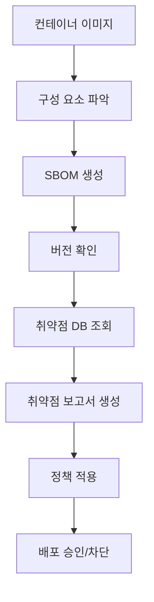

## 🛡️ 컨테이너 보안과 Trivy 개요

### 컨테이너 이미지란?

**컨테이너 이미지**는 컴퓨팅 시스템에서 컨테이너를 생성할 수 있는 **실행 코드와 해당 코드를 동작시키기 위한 파일들이 포함된 정적 파일**입니다.

### Trivy란?

**Trivy**는 **Aqua Security**에서 제작한 포괄적인 보안 스캐너로, 다양한 대상의 취약점을 탐지할 수 있는 오픈소스 도구입니다.

### Trivy의 핵심 장점

1. **포괄적 스캔**: OS 패키지뿐만 아니라 **애플리케이션 패키지까지 스캔**
2. **우수한 편의성**: CLI와 다양한 통합 환경에서 쉬운 접근성
3. **빠른 성능**: 경량화된 스캔 엔진
4. **활발한 업데이트**: 최신 취약점 DB 지속 업데이트

---

## 🎯 스캔 대상과 탐지 가능한 취약점

### 스캔 대상 (Trivy가 스캔할 수 있는 대상)

- ✅ **컨테이너 이미지**
- ✅ **파일 시스템**
- ✅ **Git 저장소(원격)**
- ✅ **가상 머신 이미지**
- ✅ **Kubernetes 클러스터**
- ✅ **AWS 리소스**

### 탐지 가능한 취약점

- 🔍 **OS 패키지 및 소프트웨어 종속성 (SBOM)**
- 🚨 **알려진 취약점 (CVE)**
- ⚙️ **IaC 문제 및 잘못된 구성**
- 🔐 **민감한 정보와 비밀**
- 📄 **소프트웨어 라이선스**

---

## 🔧 Trivy 설치 방법

### 1. 직접 설치 (스크립트 방식)

#### GitHub 설치 스크립트 사용

```bash
# 최신 버전 설치
curl -sfL https://raw.githubusercontent.com/aquasecurity/trivy/main/contrib/install.sh | sudo sh -s -- -b /usr/local/bin

# 특정 버전 설치
curl -sfL https://raw.githubusercontent.com/aquasecurity/trivy/main/contrib/install.sh | sudo sh -s -- -b /usr/local/bin v0.59.1

# 설치 확인
trivy version
```

### 2. 패키지 매니저를 통한 설치 (Ubuntu)

#### APT 저장소 설정

```bash
# 필요 패키지 설치
sudo apt-get install wget gnupg

# Trivy 공개 키 추가
wget -qO - https://aquasecurity.github.io/trivy-repo/deb/public.key | gpg --dearmor | sudo tee /usr/share/keyrings/trivy.gpg > /dev/null

# 저장소 추가
echo "deb [signed-by=/usr/share/keyrings/trivy.gpg] https://aquasecurity.github.io/trivy-repo/deb generic main" | sudo tee -a /etc/apt/sources.list.d/trivy.list

# 패키지 목록 업데이트 및 설치
sudo apt-get update
sudo apt-get install trivy
```

### 3. 컨테이너를 통한 Trivy 설치

#### Docker로 Trivy 실행

```bash
# 기본 사용법
docker run --rm -v /var/run/docker.sock:/var/run/docker.sock \
  -v $HOME/Library/Caches:/root/.cache/ aquasec/trivy:latest image python:3.9-alpine

# 로컬 이미지 스캔
docker run --rm -v /var/run/docker.sock:/var/run/docker.sock \
  aquasec/trivy:latest image <image-name>

# 파일시스템 스캔
docker run --rm -v $(pwd):/workspace aquasec/trivy:latest fs /workspace
```

#### Kubernetes에서 Trivy 실행

```yaml
# trivy-job.yaml
apiVersion: batch/v1
kind: Job
metadata:
  name: trivy-scan
spec:
  template:
    spec:
      containers:
      - name: trivy
        image: aquasec/trivy:latest
        command: ["trivy"]
        args: ["image", "--exit-code", "1", "python:3.9-alpine"]
      restartPolicy: Never
```

---

## 💻 기본 스캔 사용법

### 1. 컨테이너 이미지 스캔

#### 기본 이미지 스캔

```bash
# Python 이미지 스캔
trivy image python:3.9-alpine

# Ubuntu 이미지 스캔
trivy image ubuntu:20.04

# 자체 빌드 이미지 스캔
trivy image myapp:latest
```

#### 스캔 결과 예시 (python:3.9-alpine)

```
python:3.9-alpine (alpine 3.19.1)

Total: 2 (UNKNOWN: 0, LOW: 0, MEDIUM: 1, HIGH: 1, CRITICAL: 0)

┌─────────────┬────────────────┬──────────┬──────────────────────┬───────────────┬───────────────────────────────────────┐
│   Library   │ Vulnerability  │ Severity │ Installed Version    │ Fixed Version │                Title                  │
├─────────────┼────────────────┼──────────┼──────────────────────┼───────────────┼───────────────────────────────────────┤
│ pip         │ CVE-2023-5752  │ HIGH     │ 23.0.1               │ 23.3          │ pip: Mercurial configuration         │
│             │                │          │                      │               │ injection attack via...              │
├─────────────┼────────────────┼──────────┼──────────────────────┼───────────────┼───────────────────────────────────────┤
│ setuptools  │ CVE-2024-6345  │ MEDIUM   │ 65.5.0               │ 70.0.0        │ setuptools: Remote code execution    │
│             │                │          │                      │               │ via download functions...            │
└─────────────┴────────────────┴──────────┴──────────────────────┴───────────────┴───────────────────────────────────────┘
```

**해석:**

- 🏠 **집의 기초(운영체제)**: Alpine Linux는 안전
- 🔧 **집 안의 도구들**: pip, setuptools가 구버전이라 업데이트 필요
- 💡 **해결 방법**: pip와 setuptools를 최신 버전으로 업데이트

### 2. 파일시스템 스캔

```bash
# 현재 디렉토리 스캔
trivy fs .

# 특정 디렉토리 스캔
trivy fs /path/to/project

# requirements.txt 파일 스캔
trivy fs --scanners vuln /path/to/requirements.txt
```

### 3. Git 저장소 스캔

```bash
# 원격 Git 저장소 스캔
trivy repo https://github.com/user/repository

# 로컬 Git 저장소 스캔
trivy repo .

# 특정 브랜치 스캔
trivy repo --branch main https://github.com/user/repository
```

---

## 🎛️ 고급 스캔 기능

### 1. 심각도별 필터링

```bash
# HIGH 이상 취약점만 표시
trivy image --severity HIGH,CRITICAL python:3.9-alpine

# CRITICAL 취약점만 표시
trivy image --severity CRITICAL ubuntu:20.04

# 특정 심각도 제외
trivy image --ignore-unfixed python:3.9-alpine
```

### 2. 출력 형식 지정

```bash
# JSON 형식으로 출력
trivy image --format json python:3.9-alpine

# 표 형식으로 출력 (기본값)
trivy image --format table python:3.9-alpine

# SARIF 형식으로 출력 (GitHub Actions용)
trivy image --format sarif python:3.9-alpine

# 템플릿 사용
trivy image --format template --template "@contrib/html.tpl" python:3.9-alpine
```

### 3. 스캔 범위 제한

```bash
# OS 패키지만 스캔
trivy image --scanners vuln python:3.9-alpine

# 비밀 정보만 스캔
trivy image --scanners secret python:3.9-alpine

# 라이선스만 스캔
trivy image --scanners license python:3.9-alpine

# 복합 스캔
trivy image --scanners vuln,secret python:3.9-alpine
```

### 4. SBOM (Software Bill of Materials) 생성

```bash
# SPDX 형식의 SBOM 생성
trivy image --format spdx-json python:3.9-alpine

# CycloneDX 형식의 SBOM 생성
trivy image --format cyclonedx python:3.9-alpine

# SBOM을 파일로 저장
trivy image --format spdx-json --output sbom.json python:3.9-alpine
```

---

## 🔄 CI/CD 파이프라인 통합

### 1. Jenkins 파이프라인 통합

```groovy
pipeline {
    agent any
    
    stages {
        stage('Build') {
            steps {
                script {
                    def image = docker.build("myapp:${BUILD_NUMBER}")
                }
            }
        }
        
        stage('Security Scan') {
            steps {
                script {
                    // Trivy 스캔 실행
                    sh """
                        trivy image --exit-code 1 --severity HIGH,CRITICAL \
                        --format json --output trivy-report.json \
                        myapp:${BUILD_NUMBER}
                    """
                }
            }
            post {
                always {
                    // 스캔 결과 아카이브
                    archiveArtifacts artifacts: 'trivy-report.json', fingerprint: true
                    
                    // 보고서 퍼블리시
                    publishHTML([
                        allowMissing: false,
                        alwaysLinkToLastBuild: true,
                        keepAll: true,
                        reportDir: '.',
                        reportFiles: 'trivy-report.json',
                        reportName: 'Trivy Security Report'
                    ])
                }
            }
        }
        
        stage('Deploy') {
            when {
                expression { currentBuild.result != 'FAILURE' }
            }
            steps {
                // 보안 스캔 통과 시에만 배포
                sh "docker push myapp:${BUILD_NUMBER}"
            }
        }
    }
}
```

### 2. GitHub Actions 통합

```yaml
# .github/workflows/security-scan.yml
name: Security Scan

on:
  push:
    branches: [main, develop]
  pull_request:
    branches: [main]

jobs:
  trivy-scan:
    runs-on: ubuntu-latest
    
    steps:
    - name: Checkout code
      uses: actions/checkout@v3
    
    - name: Build Docker image
      run: docker build -t test-image:${{ github.sha }} .
    
    - name: Run Trivy vulnerability scanner
      uses: aquasecurity/trivy-action@master
      with:
        image-ref: 'test-image:${{ github.sha }}'
        format: 'sarif'
        output: 'trivy-results.sarif'
    
    - name: Upload Trivy scan results to GitHub Security tab
      uses: github/codeql-action/upload-sarif@v2
      if: always()
      with:
        sarif_file: 'trivy-results.sarif'
    
    - name: Check scan results
      run: |
        trivy image --exit-code 1 --severity HIGH,CRITICAL test-image:${{ github.sha }}
```

### 3. GitLab CI/CD 통합

```yaml
# .gitlab-ci.yml
stages:
  - build
  - security
  - deploy

variables:
  IMAGE_NAME: $CI_REGISTRY_IMAGE:$CI_COMMIT_SHA

build:
  stage: build
  script:
    - docker build -t $IMAGE_NAME .
    - docker push $IMAGE_NAME

security_scan:
  stage: security
  image: aquasec/trivy:latest
  script:
    - trivy image --exit-code 0 --format template --template "@contrib/gitlab.tpl" 
      --output gl-container-scanning-report.json $IMAGE_NAME
    - trivy image --exit-code 1 --severity HIGH,CRITICAL $IMAGE_NAME
  artifacts:
    reports:
      container_scanning: gl-container-scanning-report.json
  allow_failure: false

deploy:
  stage: deploy
  script:
    - kubectl set image deployment/myapp container=$IMAGE_NAME
  only:
    - main
```

---

## 🚢 Harbor 연동

### Harbor와 독립형 Trivy의 차이점

|특성|독립형 Trivy|Harbor의 Trivy|
|---|---|---|
|**사용 목적**|CLI 빠른 테스트|자동화된 이미지 관리|
|**스캔 방식**|수동 실행|자동 스캔|
|**결과 확인**|CLI 출력|웹 UI 대시보드|
|**정책 적용**|수동 검토|정책 기반 자동 제어|
|**팀 협업**|개인 사용|팀 전체 공유|
|**통합성**|단독 도구|레지스트리 통합|

### Harbor에서 Trivy 활성화

#### 1. Harbor 설치 시 Trivy 활성화

```yaml
# harbor-values.yaml
trivy:
  enabled: true
  image:
    repository: aquasec/trivy
    tag: latest
  replicas: 1
  resources:
    requests:
      cpu: 200m
      memory: 512Mi
    limits:
      cpu: 1000m
      memory: 1Gi
```

#### 2. Harbor UI에서 스캔 정책 설정

```
Harbor UI → Administration → Interrogation Services → Trivy → Edit
```

**설정 옵션:**

- ✅ **자동 스캔 활성화**
- ✅ **취약점 DB 자동 업데이트**
- 🔧 **스캔 스케줄 설정** (예: 매일 02:00)

#### 3. 프로젝트별 스캔 정책 설정

```
Harbor UI → Projects → [Project Name] → Configuration → Security
```

**정책 설정:**

- **스캔 자동 실행**: 이미지 푸시 시 자동 스캔
- **배포 정책**: 취약점 발견 시 이미지 다운로드 차단
- **심각도 임계값**: HIGH 이상 취약점 발견 시 차단

### Harbor + Trivy 실무 활용

#### 1. CI/CD에서 Harbor 스캔 결과 확인

```bash
# Harbor API를 통한 스캔 결과 조회
curl -u "username:password" \
  "https://harbor.example.com/api/v2.0/projects/myproject/repositories/myapp/artifacts/latest/scan"

# 스캔 완료 대기
while [ "$(curl -s -u "username:password" \
  "https://harbor.example.com/api/v2.0/projects/myproject/repositories/myapp/artifacts/latest/scan" \
  | jq -r '.scan_overview.application/vnd.security.vulnerability.report; v1.1+json.status')" != "Success" ]; do
  echo "Waiting for scan to complete..."
  sleep 10
done

# 취약점 개수 확인
VULN_COUNT=$(curl -s -u "username:password" \
  "https://harbor.example.com/api/v2.0/projects/myproject/repositories/myapp/artifacts/latest/scan" \
  | jq '.scan_overview."application/vnd.security.vulnerability.report; v1.1+json".summary.total')

if [ "$VULN_COUNT" -gt 0 ]; then
  echo "❌ 취약점 발견: $VULN_COUNT개"
  exit 1
else
  echo "✅ 취약점 없음"
fi
```

---

## 🎭 예외 처리 및 정책 관리

### 1. .trivyignore 파일 사용

#### 기본 .trivyignore 파일

```bash
# .trivyignore 파일 생성
# .gitignore와 유사한 방식으로 작동

# CVE ID로 특정 취약점 무시
CVE-2023-1234
CVE-2023-5678

# 패키지명으로 무시
pip
setuptools

# 심각도로 무시 (권장하지 않음)
# LOW
# MEDIUM

# 만료일과 함께 임시 무시
CVE-2023-9999 # 2024-12-31까지 무시

# 주석과 함께 이유 명시
CVE-2023-1111 # 개발 환경에서만 사용, 프로덕션 영향 없음
```

#### 프로젝트별 .trivyignore 파일

```bash
# 프론트엔드 프로젝트용 .trivyignore
CVE-2023-NODE-1234  # Node.js 개발 도구 관련
CVE-2023-NPM-5678   # npm 패키지 관련

# 백엔드 프로젝트용 .trivyignore  
CVE-2023-PYTHON-999 # Python 개발 라이브러리 관련
CVE-2023-PIP-123    # pip 도구 관련
```

### 2. 정책 기반 스캔 설정

#### 심각도별 정책 파일

```yaml
# trivy-policy.yaml
apiVersion: v1
kind: ConfigMap
metadata:
  name: trivy-policy
data:
  policy.rego: |
    package trivy
    
    default allow = false
    
    # CRITICAL 취약점이 있으면 차단
    deny[msg] {
        input.Results[_].Vulnerabilities[_].Severity == "CRITICAL"
        msg := "Critical vulnerabilities found"
    }
    
    # HIGH 취약점이 5개 이상이면 차단
    deny[msg] {
        high_vulns := [v | v := input.Results[_].Vulnerabilities[_]; v.Severity == "HIGH"]
        count(high_vulns) >= 5
        msg := "Too many high severity vulnerabilities"
    }
    
    # 허용 조건
    allow {
        count(deny) == 0
    }
```

#### 정책 파일 사용

```bash
# 정책 파일과 함께 스캔
trivy image --policy trivy-policy.yaml python:3.9-alpine

# 정책 위반 시 종료 코드 1 반환
trivy image --policy trivy-policy.yaml --exit-code 1 python:3.9-alpine
```

### 3. 환경별 예외 처리

#### 개발환경용 관대한 정책

```bash
# 개발환경: CRITICAL만 차단
trivy image --severity CRITICAL --exit-code 1 myapp:dev

# .trivyignore-dev 파일 사용
trivy image --ignorefile .trivyignore-dev myapp:dev
```

#### 프로덕션환경용 엄격한 정책

```bash
# 프로덕션: HIGH 이상 차단
trivy image --severity HIGH,CRITICAL --exit-code 1 myapp:prod

# 프로덕션용 엄격한 .trivyignore 사용
trivy image --ignorefile .trivyignore-prod myapp:prod
```

---

## 🎯 실무 활용 시나리오

### 1. 취약점 스캔 과정 (SBOM 기반)

#### 스캔 프로세스



#### 실제 명령어 흐름

```bash
# 1. SBOM 생성 및 취약점 스캔
trivy image --format cyclonedx --output sbom.json myapp:latest
trivy image --format json --output vulnerabilities.json myapp:latest

# 2. 정책 검증
trivy image --severity HIGH,CRITICAL --exit-code 1 myapp:latest

# 3. 보고서 생성
trivy image --format template --template "@contrib/html.tpl" \
  --output report.html myapp:latest
```

### 2. 다양한 상황별 스캔 전략

#### GitHub Actions 자동 스캔

```yaml
name: Continuous Security Scanning

on:
  push:
    branches: [main, develop]
  schedule:
    - cron: '0 2 * * *'  # 매일 새벽 2시

jobs:
  scan:
    runs-on: ubuntu-latest
    steps:
    - uses: actions/checkout@v3
    
    - name: Daily vulnerability scan
      run: |
        # 모든 Dockerfile 스캔
        find . -name "Dockerfile*" -exec trivy config {} \;
        
        # 의존성 파일 스캔
        trivy fs --scanners vuln .
        
        # Git 저장소 비밀 정보 스캔
        trivy repo --scanners secret .
```

#### Kubernetes 환경에서 정기 스캔

```yaml
# cronjob-trivy-scan.yaml
apiVersion: batch/v1
kind: CronJob
metadata:
  name: trivy-scan
spec:
  schedule: "0 2 * * *"  # 매일 새벽 2시
  jobTemplate:
    spec:
      template:
        spec:
          containers:
          - name: trivy
            image: aquasec/trivy:latest
            command:
            - /bin/sh
            - -c
            - |
              # 클러스터 내 이미지 스캔
              trivy k8s --report summary cluster
              
              # 결과를 Slack으로 전송
              if [ $? -ne 0 ]; then
                curl -X POST -H 'Content-type: application/json' \
                  --data '{"text":"⚠️ Kubernetes 클러스터에서 취약점 발견!"}' \
                  $SLACK_WEBHOOK_URL
              fi
            env:
            - name: SLACK_WEBHOOK_URL
              valueFrom:
                secretKeyRef:
                  name: slack-secret
                  key: webhook-url
          restartPolicy: OnFailure
```

#### CI/CD에서 이미지 푸시 시 자동 스캔

```bash
#!/bin/bash
# build-and-scan.sh

IMAGE_NAME="myapp:${BUILD_NUMBER}"

# 1. 이미지 빌드
docker build -t $IMAGE_NAME .

# 2. 보안 스캔
echo "🔍 보안 스캔 시작..."
if trivy image --severity HIGH,CRITICAL --exit-code 1 $IMAGE_NAME; then
    echo "✅ 보안 스캔 통과"
    
    # 3. 이미지 푸시
    docker push $IMAGE_NAME
    
    # 4. GitOps 저장소 업데이트
    update_gitops_manifest $IMAGE_NAME
    
    echo "🚀 배포 완료"
else
    echo "❌ 보안 스캔 실패 - 배포 중단"
    exit 1
fi
```

### 3. 멀티 환경 스캔 전략

#### 환경별 차별화된 정책

```bash
# 개발환경 (관대한 정책)
./scan-dev.sh() {
    trivy image \
        --severity CRITICAL \
        --ignorefile .trivyignore-dev \
        --exit-code 1 \
        $1
}

# 스테이징환경 (중간 정책)
./scan-staging.sh() {
    trivy image \
        --severity HIGH,CRITICAL \
        --ignorefile .trivyignore-staging \
        --exit-code 1 \
        $1
}

# 프로덕션환경 (엄격한 정책)
./scan-prod.sh() {
    trivy image \
        --severity MEDIUM,HIGH,CRITICAL \
        --ignorefile .trivyignore-prod \
        --exit-code 1 \
        $1
}
```

### 4. 팀 협업을 위한 보고서 생성

#### 대시보드용 JSON 보고서

```bash
# 팀 대시보드용 통합 보고서 생성
generate_security_dashboard() {
    local images=("frontend:latest" "backend:latest" "api:latest")
    local report_file="security-dashboard.json"
    
    echo '{"scans": []}' > $report_file
    
    for image in "${images[@]}"; do
        echo "📊 $image 스캔 중..."
        
        trivy image --format json --output temp.json $image
        
        # JSON 병합
        jq --slurpfile temp temp.json \
           '.scans += [{image: "'$image'", results: $temp[0]}]' \
           $report_file > temp_dashboard.json
        
        mv temp_dashboard.json $report_file
        rm temp.json
    done
    
    echo "✅ 보안 대시보드 생성 완료: $report_file"
}
```

#### HTML 보고서 생성

```bash
# 이쁜 HTML 보고서 생성
trivy image --format template \
    --template "@contrib/html.tpl" \
    --output security-report.html \
    myapp:latest

# 보고서를 웹 서버에 배포
scp security-report.html user@webserver:/var/www/security-reports/
```
